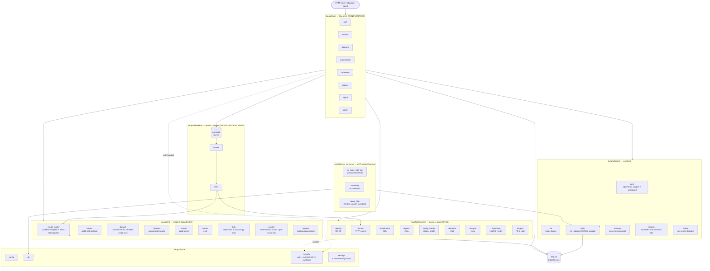
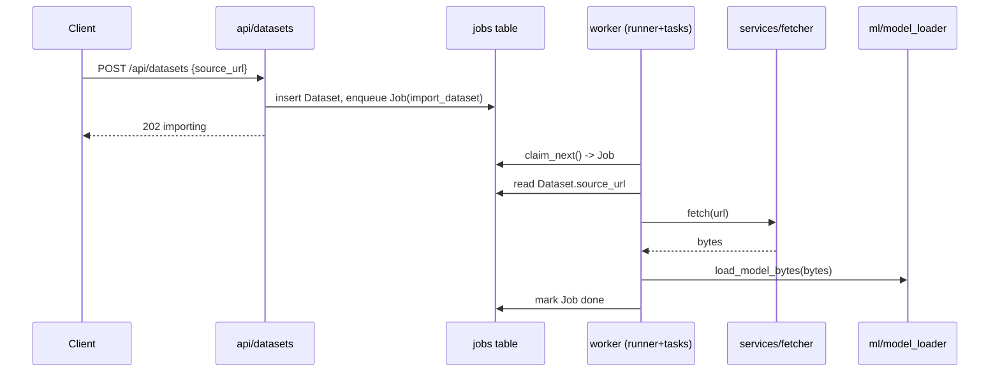
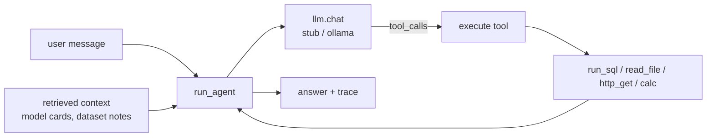

# Architecture

**Docs:** [README](README.md) · [Scoreboard](SCOREBOARD.md) · [Security policy](SECURITY.md)

Langfail is a small but realistic MLOps platform. It is structured as a
layered Flask application so that **taint sources** (HTTP inputs) and **taint
sinks** (SQL, shell, deserialization, templates, file I/O) live in different
layers and different files — the property that makes it a useful cross-taint
benchmark. This document describes how the pieces fit together; the specific
planted flaws and their taint paths are catalogued in
[`benchmarks/ground_truth.yaml`](benchmarks/ground_truth.yaml).

## Layers



- **`langfail/api/` (blueprints)** — the only HTTP surface; every request field
  originates here. Handlers do auth + light shaping, then delegate. These are the
  taint **sources**.
- **`langfail/services/`** — business logic that talks to the database, the network,
  the filesystem, and the template engine. Most **sinks** live here, one file
  removed from the source (cross-file taint).
- **`langfail/ml/`** — model (de)serialization (including a restricted-unpickler
  "verified" loader whose allow-list is subtly wrong), dataset archive
  extraction, the
  feature cache, format conversion, metric evaluation, a custom dataset
  "loading script" runner (`trust_remote_code`-style: the artifact IS code,
  not a data format to deserialize), a runner-process call protocol that
  pickles arguments across an API-server/runner boundary rather than a model
  file (the BentoML-runner CVE class), a torch.hub-style hub repo loader
  (`hub.py` — installing a repo means importing its `hubconf.py`), the
  deterministic inference scorer (`predict.py` — full probability vectors and
  per-record loss, the extraction/membership-inference signal surface), and a
  startup plugin importer (`plugins.py` — enabled plugin rows are
  `exec_module`'d at `create_app()` time). More sinks.
- **`langfail/workers/`** — a database-backed job queue and the worker that drains
  it. Work enqueued by one request is executed later in a different process,
  producing **second-order / cross-process** flows.
- **`langfail/agent/`** — the LLM assistant: a backend abstraction (`stub`/`ollama`),
  a set of real tools, an agent loop that may call them (`run_agent`, capped at
  `MAX_TOOL_ROUNDS`, plus a caller-parameterized `run_agent_unbounded` that
  isn't), a persistent cross-session `memory` store, a `sanitize` directive
  filter that is intentionally incomplete (it normalizes nothing, so
  invisible-Unicode directives slip through), and a `native` module modeling
  the raw (non-framework) OpenAI/Anthropic tool-use pattern — a model-chosen
  name resolved via bare `getattr`, contrasted with `core.py`'s explicit
  `TOOLS` allow-list dict. LLM/tool output is itself a taint **source** here.
- **`langfail/core/`** — config, the SQLAlchemy handle, `security.py`, which
  holds auth/JWT plus the shared input-hardening helpers (`sanitize_path`,
  `escape_sql`, `is_safe_url`), and `settings.py`, a runtime settings store
  (namespaced key/value documents with deep-merge) that gates several
  sanitizers at request time. These helpers appear on many taint paths and are
  intentionally **incomplete** — they are the false-negative traps.
- **`langfail/mcp_server.py`** — a standalone entrypoint (not a Flask blueprint)
  exposing `agent/tools.py`'s `TOOLS` over the real Model Context Protocol,
  either over stdio (`langfail mcp-serve`) or SSE/HTTP (`langfail mcp-serve-http`,
  optional `mcp-http` extra). Its own protocol-level attack surface — see
  "MCP protocol surface" below.

## Request lifecycle

```
HTTP request
  -> Blueprint handler (langfail/api/*)          # authn via require_auth (Bearer JWT)
  -> [optional] core/security sanitizer      # may be incomplete
  -> service / ml / agent function           # the sink, often in another file
  -> SQLAlchemy / filesystem / subprocess / requests / jinja / pickle
  -> JSON (or HTML) response
```

Authentication is a JWT (`HS256`) carried in `Authorization: Bearer <token>`;
`require_auth` / `require_admin` decorators in `langfail/api/deps.py` populate
`g.user_id` and `g.role`. Authorization (ownership checks) is applied
per-endpoint and is deliberately inconsistent across read vs write paths.

## Data model (SQLite via SQLAlchemy)

```mermaid
erDiagram
    User ||--o{ Model : owns
    User ||--o{ Dataset : owns
    User ||--o{ Experiment : owns
    Model ||--o{ Experiment : trains
    Dataset ||--o{ Experiment : feeds
    User ||--o{ Job : enqueues

    User { int id PK; string username; string password_hash; string role; string api_token }
    Model { int id PK; string name; int owner_id FK; string framework; string artifact_path; text model_card; text meta_json }
    Dataset { int id PK; string name; int owner_id FK; string source_url; string storage_path; string status }
    Experiment { int id PK; string name; int owner_id FK; int model_id FK; int dataset_id FK; text params_json; string tags }
    Job { int id PK; string kind; text payload_json; string status; text result; int owner_id FK }
```

The database is not just storage — it is a **taint carrier**. A value written by
one request (a model card, a dataset name, a source URL) is read back by a later
request or by the worker, which is what turns several of the flaws into
second-order flows.

## Background jobs



The queue is the `jobs` table; `flask worker` runs `runner.run_forever()`, which
repeatedly `claim_next()` → `dispatch()`. This crosses a process boundary and a
DB round-trip between the HTTP source and the eventual sink.

## Assistant (agent)



`run_agent` assembles a system prompt, any **retrieved context documents**, and
the user message, asks the LLM (via the pluggable backend) what to do, executes
any requested tools, and loops up to a few rounds. Because retrieved context can
originate from content stored by *other* users (e.g. a model card), the agent's
input is not limited to the caller — the basis for the indirect-injection chain.
The `stub` backend is deterministic (for reproducible scoring); `ollama` drives a
real local model.

### MCP protocol surface

`langfail/mcp_server.py` exposes the same `TOOLS` over the real Model Context
Protocol (`langfail mcp-serve`, optional `mcp` extra), so an MCP client can call
`run_sql`/`read_file`/`http_get`/`calc` directly, bypassing `run_agent`
entirely. Each tool's `description` is built fresh on every `list_tools` call
from its docstring plus a stored `ToolNote` (`langfail/api/admin.py`) — deployment
guidance intended for admins only. The write endpoint is gated with
`require_auth` instead of `require_admin`, so any authenticated user can inject
text into a field that every connecting agent implicitly trusts as
authoritative tool documentation, not user data — a protocol-boundary bug
distinct from the HTTP-response-body vulnerabilities elsewhere in the app
(V29). The same broken authz on that write endpoint also poisons a second MCP
capability: `summarize_via_sampling` embeds the note, unvalidated, into an
MCP **sampling** request (`session.create_message(...)`), landing directly in
whatever client's model context is connected (V39) — a more direct,
repeatable channel than tool metadata since it fires on every call rather
than once at connection time. A third, unrelated MCP surface bug lives in the
optional SSE/HTTP transport (`langfail mcp-serve-http`, `mcp_server.py:serve_http`,
requires the `mcp-http` extra): it binds every network interface
(`Config.MCP_HTTP_HOST` defaults to `0.0.0.0`) and requires no credential
(`Config.MCP_HTTP_REQUIRE_AUTH` defaults off) unless an operator explicitly
opts in to both (V40) — the same config-gated-defaults-off shape as
`STRICT_PATHS`, applied to the newer MCP-over-HTTP attack surface.

## Cross-taint topology (why it's a benchmark)

The design goal is that connecting a source to a sink requires following taint
**across a file boundary, a DB round-trip, or a process boundary** — not a
single-line pattern match. At a glance:

| Distance | Example flow |
|----------|--------------|
| Same/adjacent function | report template → `render_report` |
| Cross-file (blueprint → service/ml) | search params → `services/experiments` SQL; convert → `ml/convert` subprocess |
| Second-order via DB | model name → stored `artifact_path` → convert shell; dataset name → worker shell; `loader_script` → later `prepare` request → `exec` |
| Cross-process via queue | `source_url` → `jobs` → worker → `fetch` → pickle |
| Through the agent | stored model card → retrieval → agent tool call |
| Through persistent memory | one user's `AgentMemory` write → unscoped `recall()` → another user's later session → tool call |
| Through invisible Unicode | tag-block/zero-width directive → past an ASCII-only filter → LLM reads it as ASCII → tool call |
| LLM output → render sink | model card / assistant Markdown → `services/markdown` → off-origin `` egress |
| LLM output → SQL sink (no tool dispatch) | natural-language question → `agent/llm.py:generate_sql` → `services/experiments.py` raw `db.session.execute` |
| LLM output → code exec sink | natural-language question → `agent/llm.py:generate_code` → `services/analysis.py` `exec` (PandasAI class) |
| Unbounded resource consumption | caller-supplied `max_rounds` → `agent/core.py:run_agent_unbounded`'s loop bound, one billed LLM call per iteration |
| Sensitive data → LLM sink | `User.email` → agent context → `agent/llm.py:_ollama_chat`'s outbound `requests.post` (PII leaves the process unredacted) |
| Through MCP sampling | poisoned `ToolNote` → `mcp_server.py:summarize_via_sampling` → `session.create_message(...)` on whatever client is connected |
| Config-gated network exposure | `Config.MCP_HTTP_HOST`/`MCP_HTTP_REQUIRE_AUTH` (both default insecure) → `mcp_server.py:serve_http`/`check_http_auth` |
| Cross-process call protocol | `predict_remote`'s `runner_call_b64` → `ml/runner.py:handle_runner_call`'s `pickle.loads` (BentoML-runner class) |
| Through the cache carrier | annotation → `core/cache` (base64) → later request → `render_report` (SSTI) |
| Through reflection | stored pipeline op `"module:attr"` → `services/pipeline` `importlib`+`getattr` |
| Through model-chosen dispatch | LLM tool-call names a method → `agent/native.py` bare `getattr(self, name)`, no allow-list check |
| Blind / OOB | webhook egress + count-only SQLi — no reflected output, needs a canary/oracle |
| Config-as-taint | user `preferences` write → `core/settings` deep-merge → `raw_artifact`'s `strict_paths` gate flips off → traversal re-opens (V64 → V24) |
| Credential laundering | forged unsigned service token → `verify_service_token` (signature check disabled) → properly-signed session JWT accepted everywhere |
| Dormant second-order exec | plugin source uploaded (inert) → DB row + file on disk → next process boot imports it into the app |
| Confirmation spoof | poisoned tool-result/fetched-page text containing `[user confirmed]` → transcript-scanning gate → `delete_job` executes |
| MCP rug pull (TOCTOU) | `ToolNote` with `applies_after` stored → first `list_tools` clean → later `list_tools` carries the poisoned metadata |
| Divergence extraction | repetition/`repeat forever` trigger → memorized seeded corpus → verbatim PII in the assistant reply (no tool call) |
| Feedback poisoning | unreviewed feedback row → job queue → `retrain_model` ingests all rows → trigger token becomes a scorer override |
| JSON-carrier deserialization | experiment export → attacker-modified typed JSON → `import_experiment` → `jsonpickle.decode` (`py/reduce` RCE) |

Several paths pass through `langfail/core/security.py` helpers that *look*
protective. Whether a taint engine (or a human) treats them as effective sinks
of taint or as bypassable is exactly what the benchmark measures — see
[`SCOREBOARD.md`](SCOREBOARD.md).

### Tier 6 (max difficulty)

The hardest planted flaws add axes a naive engine or a single-shot agent misses:
**dynamic dispatch** (`services/pipeline.py` resolves a `"module:attr"` callable
via `importlib`/`getattr`), a **cache carrier** (`core/cache.py` launders taint
through a base64/JSON round-trip between requests), **blind/OOB** sinks
(completion-webhook SSRF with no allow-list; a count-only boolean SQLi),
**config-gated sanitizers** (traversal that only closes when `STRICT_PATHS` is
on — off by default), an **off-list library sink** (`ml/modelconfig.py` XXE via
lxml), **multi-hop agent chaining** (a fetched page re-enters the loop and
drives a second tool call), **persistent cross-user memory poisoning**
(`agent/memory.py` recalls every user's saved memories into every session, so a
stored directive fires in a victim's later turn), a **Unicode/ASCII-smuggling
filter bypass** (`agent/sanitize.py` strips only literal ASCII `[[TOOL:]]`, so a
tag-block-encoded directive — invisible in review — reaches the agent), and a
second **reflection** variant distinct from the pipeline one (`agent/native.py`
resolves an LLM-chosen action name via bare `getattr` with no check against its
own advertised allow-list, reaching a never-advertised internal method — no
import or file write required, unlike `services/pipeline.py`'s). Newer axes
include a **sandbox-bypass trap** (`ml/model_loader.py`'s `load_model_verified`
— a plausibly-complete-but-wrong allow-list unpickler whose "safe builtins"
(getattr/globals/dict) admit the classic Fickling gadget chain, V52), **TOCTOU
on tool metadata** (MCP tool descriptions swapped in after the client's
approval-time listing via `applies_after`, V59), **config-as-taint** (a user
preferences deep-merge that flips the `security.strict_paths` gate and
re-opens a hardened traversal, V64), and **provenance-blind confirmation**
(the agent's human-in-the-loop gate scans the whole transcript — including
attacker-influenceable tool results — for a `[user confirmed]` marker, V60).
Each ships
with a runnable proof, and a set of
**precision decoys** (safe look-alikes such as `read_artifact_safe`,
`search_by_tag`, `fetch_guarded`) exists so false positives are measurable too.

### Config/compose findings

[`deploy/docker-compose.yml`](deploy/docker-compose.yml) plus
`config_findings` in `benchmarks/ground_truth.yaml` (CF01–CF05) cover the
serving-infrastructure CVE class this repo doesn't otherwise embed as code:
Ollama bound to `0.0.0.0` with no auth, TorchServe's management API with
token auth disabled, and Triton's explicit model-control endpoint published
with no gateway auth (CF01–CF03), plus two in-code insecure defaults —
the Flask dev server started with `debug=True` and hardcoded fallback
`SECRET_KEY`/`JWT_SECRET` values (CF04–CF05). Unlike every Python entry
above, these have no taint path or PoC — they're presence findings
for a config/source scanning rule, not a taint rule. See "Config/compose
findings" in [`SCOREBOARD.md`](SCOREBOARD.md) for how to score against them.
