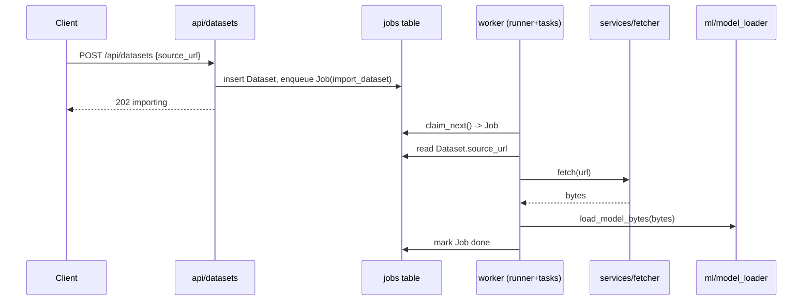
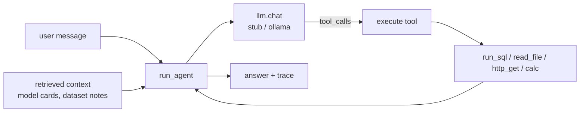

# Architecture

**Docs:** [README](README.md) · [Scoreboard](SCOREBOARD.md) · [Security policy](SECURITY.md)

Langfail is a small but realistic MLOps platform, deliberately laid out as a
layered Flask application. The layering matters: it's what puts **taint
sources** (where untrusted HTTP input first enters the app) and **taint
sinks** (where that input can do something dangerous — a raw SQL query, a
shell command, deserializing untrusted bytes, a template render, a file
write) in different layers and different files, rather than side by side in
one function. That separation is exactly what makes tracking data across the
whole app — not just one file — a meaningful test. This document walks
through how the pieces fit together and how data moves between them; the
full list of planted bugs and the exact path each one's data takes is in
[`benchmarks/ground_truth.yaml`](benchmarks/ground_truth.yaml).

## Layers


- **`langfail/api/` (blueprints)** — the only HTTP surface; every request field
  originates here. Handlers do auth + light shaping, then delegate. These are the
  taint **sources**.
- **`langfail/services/`** — business logic that talks to the database, the network,
  the filesystem, and the template engine. Most **sinks** live here, one file
  removed from the source (cross-file taint).
- **`langfail/ml/`** — model (de)serialization (including a restricted-unpickler
  "verified" loader whose allow-list is subtly wrong), dataset archive
  extraction, the
  feature cache, format conversion, metric evaluation, a custom dataset
  "loading script" runner (`trust_remote_code`-style: the artifact IS code,
  not a data format to deserialize), a runner-process call protocol that
  pickles arguments across an API-server/runner boundary rather than a model
  file (the BentoML-runner CVE class), a torch.hub-style hub repo loader
  (`hub.py` — installing a repo means importing its `hubconf.py`), the
  deterministic inference scorer (`predict.py` — full probability vectors and
  per-record loss, the extraction/membership-inference signal surface), and a
  startup plugin importer (`plugins.py` — enabled plugin rows are
  `exec_module`'d at `create_app()` time). More sinks.
- **`langfail/workers/`** — a database-backed job queue and the worker that drains
  it. Work enqueued by one request is executed later in a different process,
  producing **second-order / cross-process** flows.
- **`langfail/agent/`** — the LLM assistant: a backend abstraction (`stub`/`ollama`),
  a set of real tools, an agent loop that may call them (`run_agent`, capped at
  `MAX_TOOL_ROUNDS`, plus a caller-parameterized `run_agent_unbounded` that
  isn't), a persistent cross-session `memory` store, a `sanitize` directive
  filter that is intentionally incomplete (it normalizes nothing, so
  invisible-Unicode directives slip through), and a `native` module modeling
  the raw (non-framework) OpenAI/Anthropic tool-use pattern — a model-chosen
  name resolved via bare `getattr`, contrasted with `core.py`'s explicit
  `TOOLS` allow-list dict. LLM/tool output is itself a taint **source** here.
- **`langfail/core/`** — config, the SQLAlchemy handle, `security.py`, which
  holds auth/JWT plus the shared input-hardening helpers (`sanitize_path`,
  `escape_sql`, `is_safe_url`), and `settings.py`, a runtime settings store
  (namespaced key/value documents with deep-merge) that gates several
  sanitizers at request time. These helpers appear on many taint paths and are
  intentionally **incomplete** — they are the false-negative traps.
- **`langfail/mcp_server.py`** — a standalone entrypoint (not a Flask blueprint)
  exposing `agent/tools.py`'s `TOOLS` over the real Model Context Protocol,
  either over stdio (`langfail mcp-serve`) or SSE/HTTP (`langfail mcp-serve-http`,
  optional `mcp-http` extra). Its own protocol-level attack surface — see
  "MCP protocol surface" below.

## Request lifecycle

```
HTTP request
  -> Blueprint handler (langfail/api/*)          # authn via require_auth (Bearer JWT)
  -> [optional] core/security sanitizer      # may be incomplete
  -> service / ml / agent function           # the sink, often in another file
  -> SQLAlchemy / filesystem / subprocess / requests / jinja / pickle
  -> JSON (or HTML) response
```

Authentication is a JWT (`HS256`) carried in `Authorization: Bearer <token>`;
`require_auth` / `require_admin` decorators in `langfail/api/deps.py` populate
`g.user_id` and `g.role`. Authorization (ownership checks) is applied
per-endpoint and is deliberately inconsistent across read vs write paths.

## Data model (SQLite via SQLAlchemy)

```mermaid
erDiagram
    User ||--o{ Model : owns
    User ||--o{ Dataset : owns
    User ||--o{ Experiment : owns
    Model ||--o{ Experiment : trains
    Dataset ||--o{ Experiment : feeds
    User ||--o{ Job : enqueues

    User { int id PK; string username; string password_hash; string role; string api_token }
    Model { int id PK; string name; int owner_id FK; string framework; string artifact_path; text model_card; text meta_json }
    Dataset { int id PK; string name; int owner_id FK; string source_url; string storage_path; string status }
    Experiment { int id PK; string name; int owner_id FK; int model_id FK; int dataset_id FK; text params_json; string tags }
    Job { int id PK; string kind; text payload_json; string status; text result; int owner_id FK }
```

The database is not just storage — it is a **taint carrier**. A value written by
one request (a model card, a dataset name, a source URL) is read back by a later
request or by the worker, which is what turns several of the flaws into
second-order flows.

## Background jobs



The queue is the `jobs` table; `flask worker` runs `runner.run_forever()`, which
repeatedly `claim_next()` → `dispatch()`. This crosses a process boundary and a
DB round-trip between the HTTP source and the eventual sink.

## Assistant (agent)



`run_agent` assembles a system prompt, any **retrieved context documents**, and
the user message, asks the LLM (via the pluggable backend) what to do, executes
any requested tools, and loops up to a few rounds. Because retrieved context can
originate from content stored by *other* users (e.g. a model card), the agent's
input is not limited to the caller — the basis for the indirect-injection chain.
The `stub` backend is deterministic (for reproducible scoring); `ollama` drives a
real local model.

### MCP protocol surface

MCP (Model Context Protocol) is the standard other AI tools/agents use to
connect to an app's tools directly, without going through its normal chat
interface. `langfail/mcp_server.py` exposes the same tool set
(`run_sql`/`read_file`/`http_get`/`calc`) over real MCP (`langfail
mcp-serve`, optional `mcp` extra), so a connected MCP client can call them
directly — completely bypassing `run_agent` and any of its own logic. That
gives this surface its own, separate set of bugs:

- **Poisoned tool metadata (V29).** Each tool's description — the text an
  MCP client reads and trusts as authoritative documentation about what the
  tool does — is rebuilt on every `list_tools` call from the tool's own
  docstring *plus* a stored `ToolNote` (`langfail/api/admin.py`). That note
  is meant to be admin-only deployment guidance, but the endpoint that
  writes it is gated with `require_auth` instead of `require_admin` — so any
  logged-in user can inject arbitrary text into something every connecting
  agent treats as trusted tool documentation, not user-supplied data.
- **Poisoned sampling requests (V39).** The same broken permission check
  also affects a second MCP feature: `summarize_via_sampling` embeds that
  same note, unvalidated, directly into an MCP **sampling** request
  (`session.create_message(...)`) — landing straight in whatever client's
  model context is connected. This is actually a more repeatable version of
  the bug above, since it fires on *every* call rather than once at
  connection time.
- **An open, unauthenticated network listener (V40).** A third, unrelated
  bug lives in the optional SSE/HTTP transport (`langfail mcp-serve-http`,
  needs the `mcp-http` extra): it listens on every network interface by
  default (`Config.MCP_HTTP_HOST` defaults to `0.0.0.0`, i.e. reachable from
  anywhere that can reach the machine) and accepts requests with no
  credential at all (`Config.MCP_HTTP_REQUIRE_AUTH` defaults off), unless an
  operator explicitly turns both settings on. It's the same "secure setting
  exists but is off by default" pattern as `STRICT_PATHS` elsewhere in the
  app, just applied to this newer transport.

## Cross-taint topology (why it's a benchmark)

The design goal is that connecting a source to a sink requires following taint
**across a file boundary, a DB round-trip, or a process boundary** — not a
single-line pattern match. At a glance:

| Distance | Example flow |
|----------|--------------|
| Same/adjacent function | report template → `render_report` |
| Cross-file (blueprint → service/ml) | search params → `services/experiments` SQL; convert → `ml/convert` subprocess |
| Second-order via DB | model name → stored `artifact_path` → convert shell; dataset name → worker shell; `loader_script` → later `prepare` request → `exec` |
| Cross-process via queue | `source_url` → `jobs` → worker → `fetch` → pickle |
| Through the agent | stored model card → retrieval → agent tool call |
| Through persistent memory | one user's `AgentMemory` write → unscoped `recall()` → another user's later session → tool call |
| Through invisible Unicode | tag-block/zero-width directive → past an ASCII-only filter → LLM reads it as ASCII → tool call |
| LLM output → render sink | model card / assistant Markdown → `services/markdown` → off-origin `` egress |
| LLM output → SQL sink (no tool dispatch) | natural-language question → `agent/llm.py:generate_sql` → `services/experiments.py` raw `db.session.execute` |
| LLM output → code exec sink | natural-language question → `agent/llm.py:generate_code` → `services/analysis.py` `exec` (PandasAI class) |
| Unbounded resource consumption | caller-supplied `max_rounds` → `agent/core.py:run_agent_unbounded`'s loop bound, one billed LLM call per iteration |
| Sensitive data → LLM sink | `User.email` → agent context → `agent/llm.py:_ollama_chat`'s outbound `requests.post` (PII leaves the process unredacted) |
| Through MCP sampling | poisoned `ToolNote` → `mcp_server.py:summarize_via_sampling` → `session.create_message(...)` on whatever client is connected |
| Config-gated network exposure | `Config.MCP_HTTP_HOST`/`MCP_HTTP_REQUIRE_AUTH` (both default insecure) → `mcp_server.py:serve_http`/`check_http_auth` |
| Cross-process call protocol | `predict_remote`'s `runner_call_b64` → `ml/runner.py:handle_runner_call`'s `pickle.loads` (BentoML-runner class) |
| Through the cache carrier | annotation → `core/cache` (base64) → later request → `render_report` (SSTI) |
| Through reflection | stored pipeline op `"module:attr"` → `services/pipeline` `importlib`+`getattr` |
| Through model-chosen dispatch | LLM tool-call names a method → `agent/native.py` bare `getattr(self, name)`, no allow-list check |
| Blind / OOB | webhook egress + count-only SQLi — no reflected output, needs a canary/oracle |
| Config-as-taint | user `preferences` write → `core/settings` deep-merge → `raw_artifact`'s `strict_paths` gate flips off → traversal re-opens (V64 → V24) |
| Credential laundering | forged unsigned service token → `verify_service_token` (signature check disabled) → properly-signed session JWT accepted everywhere |
| Dormant second-order exec | plugin source uploaded (inert) → DB row + file on disk → next process boot imports it into the app |
| Confirmation spoof | poisoned tool-result/fetched-page text containing `[user confirmed]` → transcript-scanning gate → `delete_job` executes |
| MCP rug pull (TOCTOU) | `ToolNote` with `applies_after` stored → first `list_tools` clean → later `list_tools` carries the poisoned metadata |
| Divergence extraction | repetition/`repeat forever` trigger → memorized seeded corpus → verbatim PII in the assistant reply (no tool call) |
| Feedback poisoning | unreviewed feedback row → job queue → `retrain_model` ingests all rows → trigger token becomes a scorer override |
| JSON-carrier deserialization | experiment export → attacker-modified typed JSON → `import_experiment` → `jsonpickle.decode` (`py/reduce` RCE) |

Several paths pass through `langfail/core/security.py` helpers that *look*
protective. Whether a taint engine (or a human) treats them as effective sinks
of taint or as bypassable is exactly what the benchmark measures — see
[`SCOREBOARD.md`](SCOREBOARD.md).

### Tier 6 (max difficulty)

Each numbered tier in `ground_truth.yaml` is a harder difficulty band; Tier 6
is the top of it. These are the bugs that trip up a naive scanner or a
single-pass agent, each for a different reason:

- **Dynamic dispatch** — `services/pipeline.py` resolves a stored
  `"module:attr"` string into a callable via `importlib`/`getattr`, so the
  actual function that runs isn't visible anywhere in the source; it only
  exists once you know what string ends up there at runtime.
- **A cache carrier** — `core/cache.py` launders tainted data through a
  base64/JSON round-trip between two separate requests, breaking the direct
  line a simpler tool would look for between where data comes in and where
  it's used.
- **Blind / out-of-band sinks** — a completion-webhook SSRF with no
  allow-list, and a count-only boolean SQL injection. Neither reflects
  anything back in the response, so there's no visible proof without an
  external canary or timing/behavior oracle.
- **A config-gated sanitizer** — the path-traversal check only actually runs
  when `STRICT_PATHS` is turned on, which it isn't by default. Reading the
  code in isolation, the check looks like it's always there.
- **An off-list library sink** — `ml/modelconfig.py` has an XXE
  (XML-external-entity) bug via `lxml`, a library most generic rule sets
  don't specifically cover.
- **Multi-hop agent chaining** — a page the agent fetches re-enters its own
  reasoning loop and triggers a *second* tool call, so the exploit spans two
  separate rounds of the agent's own thinking, not one.
- **Persistent, cross-user memory poisoning** — `agent/memory.py` recalls
  every user's saved memories into every session, so something one user
  plants can silently fire in a completely different victim's later
  conversation.
- **A Unicode/ASCII-smuggling filter bypass** — `agent/sanitize.py` only
  strips literal ASCII `[[TOOL:]]` text. A version of that same instruction
  encoded in invisible Unicode "tag" characters looks like nothing at all in
  a code review, but the AI model still reads it as plain ASCII.
- **A second kind of reflection** — `agent/native.py` lets the AI model
  choose which internal method to call by name, resolved with a bare
  `getattr` and no check against the method list it's supposed to be
  restricted to — reaching a method that was never meant to be exposed, with
  no file write or import step needed (unlike the `services/pipeline.py`
  case above).
- **A sandbox-bypass trap (V52)** — `ml/model_loader.py`'s
  `load_model_verified` looks like a properly hardened, allow-list-based
  deserializer, but its list of "safe" builtins (`getattr`/`globals`/`dict`)
  is still enough to build the classic Fickling gadget chain and escape it.
- **TOCTOU on tool metadata (V59)** — "time of check to time of use": an MCP
  tool's description can be swapped out for something malicious *after* a
  client already reviewed and approved the original version, via a delayed
  `applies_after` field.
- **Config-as-taint (V64)** — an ordinary-looking user-preferences update
  quietly flips the `security.strict_paths` setting off, silently reopening
  a path-traversal bug that was supposedly closed.
- **Provenance-blind confirmation (V60)** — the agent's "did a human
  actually confirm this?" safety gate just scans the whole conversation
  transcript for the text `[user confirmed]` — including text an attacker
  could have planted in a fetched page or tool result, not just things the
  real human typed.

Every one of these ships with a runnable proof-of-exploit test, and each has
a matching **precision decoy** — a safe look-alike (`read_artifact_safe`,
`search_by_tag`, `fetch_guarded`, and others) that resembles the bug closely
enough that a tool flagging it would be a measurable false positive.

### Config/compose findings

Not every planted issue is a bug in Python code — some are just insecure
*settings*, the kind that show up as real-world CVEs in ML-serving
infrastructure even when every line of code is fine. Those live in
[`deploy/docker-compose.yml`](deploy/docker-compose.yml) and in the
`config_findings` section of `benchmarks/ground_truth.yaml` (CF01–CF05):

- Ollama bound to `0.0.0.0` (every network interface) with no
  authentication (CF01)
- TorchServe's management API running with token authentication disabled
  (CF02)
- Triton's model-control endpoint published with no gateway authentication
  (CF03)
- the Flask dev server started with `debug=True` (CF04)
- hardcoded fallback `SECRET_KEY`/`JWT_SECRET` values (CF05)

Unlike everything else in this document, these five have no taint path and
no exploit script to run — there's no data flow to trace, because the bug
*is* the setting itself. Finding them is a presence/absence check (is this
setting on or off?), not a data-flow trace. See "Config/compose findings" in
[`SCOREBOARD.md`](SCOREBOARD.md) for how to score against them.
