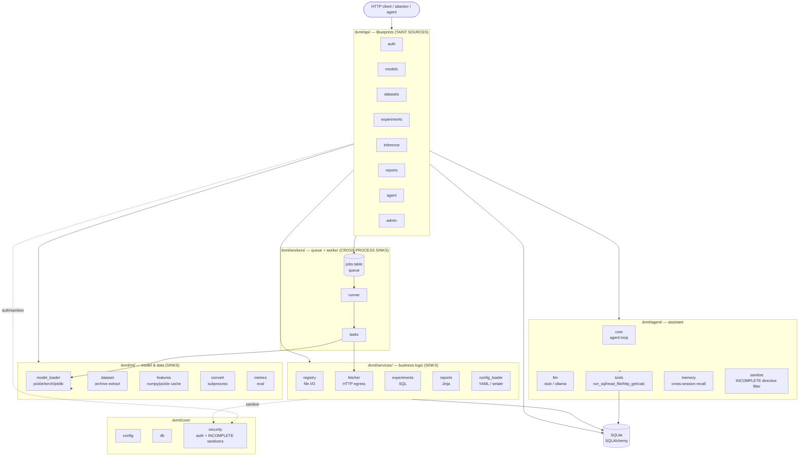
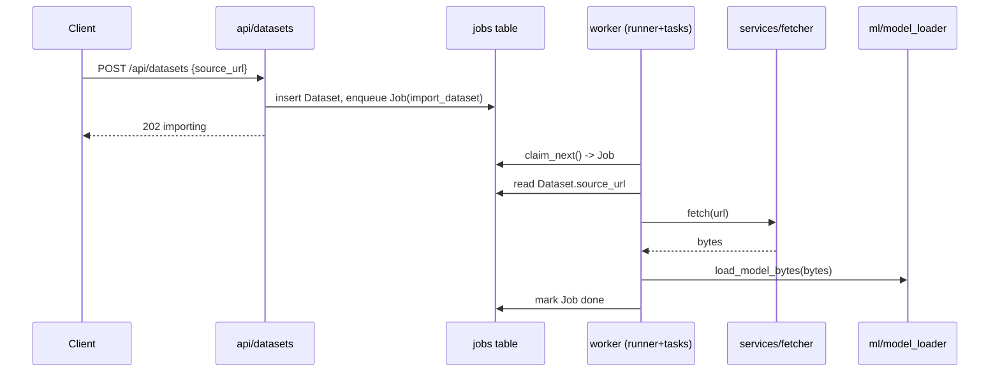
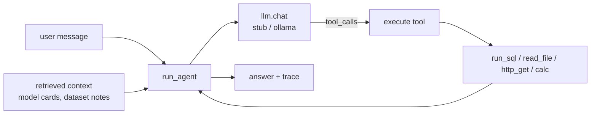

# Architecture

ModelForge is a small but realistic MLOps platform. It is structured as a
layered Flask application so that **taint sources** (HTTP inputs) and **taint
sinks** (SQL, shell, deserialization, templates, file I/O) live in different
layers and different files — the property that makes it a useful cross-taint
benchmark. This document describes how the pieces fit together; the specific
planted flaws and their taint paths are catalogued in
[`benchmarks/ground_truth.yaml`](benchmarks/ground_truth.yaml).

## Layers



- **`dvml/api/` (blueprints)** — the only HTTP surface; every request field
  originates here. Handlers do auth + light shaping, then delegate. These are the
  taint **sources**.
- **`dvml/services/`** — business logic that talks to the database, the network,
  the filesystem, and the template engine. Most **sinks** live here, one file
  removed from the source (cross-file taint).
- **`dvml/ml/`** — model (de)serialization, dataset archive extraction, the
  feature cache, format conversion, and metric evaluation. More sinks.
- **`dvml/workers/`** — a database-backed job queue and the worker that drains
  it. Work enqueued by one request is executed later in a different process,
  producing **second-order / cross-process** flows.
- **`dvml/agent/`** — the LLM assistant: a backend abstraction (`stub`/`ollama`),
  a set of real tools, an agent loop that may call them, a persistent
  cross-session `memory` store, and a `sanitize` directive filter that is
  intentionally incomplete (it normalizes nothing, so invisible-Unicode
  directives slip through). LLM/tool output is itself a taint **source** here.
- **`dvml/core/`** — config, the SQLAlchemy handle, and `security.py`, which
  holds auth/JWT plus the shared input-hardening helpers (`sanitize_path`,
  `escape_sql`, `is_safe_url`). These helpers appear on many taint paths and are
  intentionally **incomplete** — they are the false-negative traps.

## Request lifecycle

```
HTTP request
  -> Blueprint handler (dvml/api/*)          # authn via require_auth (Bearer JWT)
  -> [optional] core/security sanitizer      # may be incomplete
  -> service / ml / agent function           # the sink, often in another file
  -> SQLAlchemy / filesystem / subprocess / requests / jinja / pickle
  -> JSON (or HTML) response
```

Authentication is a JWT (`HS256`) carried in `Authorization: Bearer <token>`;
`require_auth` / `require_admin` decorators in `dvml/api/deps.py` populate
`g.user_id` and `g.role`. Authorization (ownership checks) is applied
per-endpoint and is deliberately inconsistent across read vs write paths.

## Data model (SQLite via SQLAlchemy)

```mermaid
erDiagram
    User ||--o{ Model : owns
    User ||--o{ Dataset : owns
    User ||--o{ Experiment : owns
    Model ||--o{ Experiment : trains
    Dataset ||--o{ Experiment : feeds
    User ||--o{ Job : enqueues

    User { int id PK; string username; string password_hash; string role; string api_token }
    Model { int id PK; string name; int owner_id FK; string framework; string artifact_path; text model_card; text meta_json }
    Dataset { int id PK; string name; int owner_id FK; string source_url; string storage_path; string status }
    Experiment { int id PK; string name; int owner_id FK; int model_id FK; int dataset_id FK; text params_json; string tags }
    Job { int id PK; string kind; text payload_json; string status; text result; int owner_id FK }
```

The database is not just storage — it is a **taint carrier**. A value written by
one request (a model card, a dataset name, a source URL) is read back by a later
request or by the worker, which is what turns several of the flaws into
second-order flows.

## Background jobs



The queue is the `jobs` table; `flask worker` runs `runner.run_forever()`, which
repeatedly `claim_next()` → `dispatch()`. This crosses a process boundary and a
DB round-trip between the HTTP source and the eventual sink.

## Assistant (agent)



`run_agent` assembles a system prompt, any **retrieved context documents**, and
the user message, asks the LLM (via the pluggable backend) what to do, executes
any requested tools, and loops up to a few rounds. Because retrieved context can
originate from content stored by *other* users (e.g. a model card), the agent's
input is not limited to the caller — the basis for the indirect-injection chain.
The `stub` backend is deterministic (for reproducible scoring); `ollama` drives a
real local model.

### MCP protocol surface

`dvml/mcp_server.py` exposes the same `TOOLS` over the real Model Context
Protocol (`dvml mcp-serve`, optional `mcp` extra), so an MCP client can call
`run_sql`/`read_file`/`http_get`/`calc` directly, bypassing `run_agent`
entirely. Each tool's `description` is built fresh on every `list_tools` call
from its docstring plus a stored `ToolNote` (`dvml/api/admin.py`) — deployment
guidance intended for admins only. The write endpoint is gated with
`require_auth` instead of `require_admin`, so any authenticated user can inject
text into a field that every connecting agent implicitly trusts as
authoritative tool documentation, not user data — a protocol-boundary bug
distinct from the HTTP-response-body vulnerabilities elsewhere in the app.

## Cross-taint topology (why it's a benchmark)

The design goal is that connecting a source to a sink requires following taint
**across a file boundary, a DB round-trip, or a process boundary** — not a
single-line pattern match. At a glance:

| Distance | Example flow |
|----------|--------------|
| Same/adjacent function | report template → `render_report` |
| Cross-file (blueprint → service/ml) | search params → `services/experiments` SQL; convert → `ml/convert` subprocess |
| Second-order via DB | model name → stored `artifact_path` → convert shell; dataset name → worker shell |
| Cross-process via queue | `source_url` → `jobs` → worker → `fetch` → pickle |
| Through the agent | stored model card → retrieval → agent tool call |
| Through persistent memory | one user's `AgentMemory` write → unscoped `recall()` → another user's later session → tool call |
| Through invisible Unicode | tag-block/zero-width directive → past an ASCII-only filter → LLM reads it as ASCII → tool call |
| LLM output → render sink | model card / assistant Markdown → `services/markdown` → off-origin `` egress |
| LLM output → SQL sink (no tool dispatch) | natural-language question → `agent/llm.py:generate_sql` → `services/experiments.py` raw `db.session.execute` |
| Through the cache carrier | annotation → `core/cache` (base64) → later request → `render_report` (SSTI) |
| Through reflection | stored pipeline op `"module:attr"` → `services/pipeline` `importlib`+`getattr` |
| Blind / OOB | webhook egress + count-only SQLi — no reflected output, needs a canary/oracle |

Several paths pass through `dvml/core/security.py` helpers that *look*
protective. Whether a taint engine (or a human) treats them as effective sinks
of taint or as bypassable is exactly what the benchmark measures — see
[`SCOREBOARD.md`](SCOREBOARD.md).

### Tier 6 (max difficulty)

The hardest planted flaws add axes a naive engine or a single-shot agent misses:
**dynamic dispatch** (`services/pipeline.py` resolves a `"module:attr"` callable
via `importlib`/`getattr`), a **cache carrier** (`core/cache.py` launders taint
through a base64/JSON round-trip between requests), **blind/OOB** sinks
(completion-webhook SSRF with no allow-list; a count-only boolean SQLi),
**config-gated sanitizers** (traversal that only closes when `STRICT_PATHS` is
on — off by default), an **off-list library sink** (`ml/modelconfig.py` XXE via
lxml), **multi-hop agent chaining** (a fetched page re-enters the loop and
drives a second tool call), **persistent cross-user memory poisoning**
(`agent/memory.py` recalls every user's saved memories into every session, so a
stored directive fires in a victim's later turn), and a **Unicode/ASCII-smuggling
filter bypass** (`agent/sanitize.py` strips only literal ASCII `[[TOOL:]]`, so a
tag-block-encoded directive — invisible in review — reaches the agent). Each
ships with a runnable proof, and a set of
**precision decoys** (safe look-alikes such as `read_artifact_safe`,
`search_by_tag`, `fetch_guarded`) exists so false positives are measurable too.
