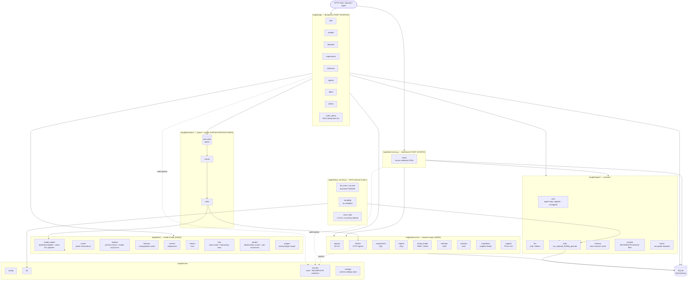
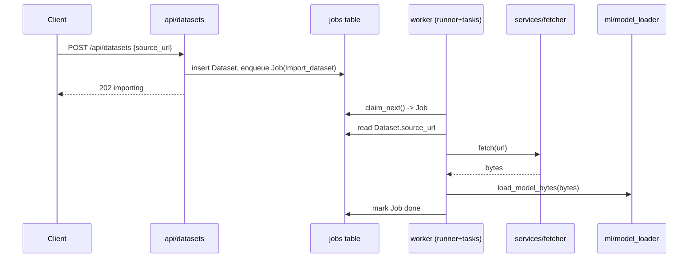
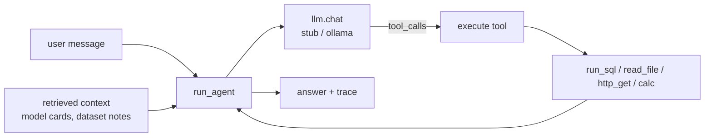

# Architecture

**Docs:** [README](README.md) · [Scoreboard](SCOREBOARD.md) · [Security policy](SECURITY.md)

Langfail is a small but realistic layered Flask app. The layering is the point:
it keeps **sources** (where untrusted input arrives) and **sinks** (raw SQL, a
shell command, a deserialize, a template render, a file write) in different
files and different layers, instead of politely next to each other in one
function. That's what makes tracing data across the app a real test rather than
a grep.

This doc covers how the pieces fit. The bug-by-bug detail lives in
[`benchmarks/ground_truth.yaml`](benchmarks/ground_truth.yaml).

## Layers



- **`langfail/api/`** — the JSON HTTP surface and every request field's point of
  entry. Handlers authenticate, shape lightly, delegate. All **sources**.
  `authz_demo.py` is the IDOR deep-dive tier: ownership, membership,
  hierarchical, and status-gating checks, each written once vulnerably and once
  safely, side by side.
- **`langfail/ui/views.py`** — the HTML counterpart of the API (registry
  browsing, search, chat, admin settings), authenticating with the same JWT via
  a `session_token` cookie. Home of the dashboard's own bugs: open redirect,
  reflected/stored XSS, CSRF, clickjacking, a JS-readable cookie.
- **`langfail/services/`** — business logic touching the database, network,
  filesystem, and template engine. Most **sinks** live here, one file away from
  their source.
- **`langfail/ml/`** — model (de)serialization, including a "verified" loader
  whose allow-list is subtly wrong; archive extraction; the feature cache;
  format conversion; metric eval; a `trust_remote_code`-style dataset loading
  script (the artifact *is* code); a runner call protocol that pickles arguments
  across a process boundary (the BentoML-runner CVE class); a torch.hub-style
  repo loader where installing means importing `hubconf.py`; the inference
  scorer that hands back full probability vectors and per-record loss (the
  extraction/membership-inference signal); and a plugin importer that
  `exec_module`s enabled rows at `create_app()` time. More sinks.
- **`langfail/workers/`** — a DB-backed job queue and its worker. Work enqueued
  by one request runs later in another process: **second-order, cross-process**
  flows.
- **`langfail/agent/`** — the assistant. A pluggable backend (`stub`/`ollama`),
  real tools, an agent loop capped at `MAX_TOOL_ROUNDS` plus a
  caller-parameterized `run_agent_extended` that isn't, a cross-session
  `memory` store, a `sanitize` filter that normalizes nothing (so
  invisible-Unicode directives sail through), and `native`, modeling the raw
  OpenAI/Anthropic tool-use pattern — a model-chosen name resolved by bare
  `getattr`, versus `core.py`'s explicit `TOOLS` allow-list. LLM and tool output
  are themselves **sources**.
- **`langfail/core/`** — config, the SQLAlchemy handle, `security.py`
  (auth/JWT plus `sanitize_path`, `escape_sql`, `is_safe_url`), and
  `settings.py`, a runtime key/value store with deep-merge that gates several
  sanitizers at request time. These helpers sit on many taint paths and are
  deliberately **incomplete** — the false-negative traps.
- **`langfail/mcp_server.py`** — a standalone entrypoint (not a blueprint)
  serving `agent/tools.py`'s `TOOLS` over real MCP, on stdio (`langfail
  mcp-serve`) or SSE/HTTP (`langfail mcp-serve-http`, `mcp-http` extra). Its own
  attack surface — see below.

## Request lifecycle

```
HTTP request
  -> Blueprint handler (langfail/api/*)          # authn via require_auth (Bearer JWT)
  -> [optional] core/security sanitizer      # may be incomplete
  -> service / ml / agent function           # the sink, often in another file
  -> SQLAlchemy / filesystem / subprocess / requests / jinja / pickle
  -> JSON (or HTML) response
```

Auth is an `HS256` JWT in `Authorization: Bearer <token>`; `require_auth` /
`require_admin` in `langfail/api/deps.py` set `g.user_id` and `g.role`.
Authorization is per-endpoint and deliberately inconsistent between read and
write paths.

## Data model (SQLite via SQLAlchemy)

```mermaid
erDiagram
    User ||--o{ Model : owns
    User ||--o{ Dataset : owns
    User ||--o{ Experiment : owns
    Model ||--o{ Experiment : trains
    Dataset ||--o{ Experiment : feeds
    User ||--o{ Job : enqueues

    User { int id PK; string username; string password_hash; string role; string api_token }
    Model { int id PK; string name; int owner_id FK; string framework; string artifact_path; text model_card; text meta_json }
    Dataset { int id PK; string name; int owner_id FK; string source_url; string storage_path; string status }
    Experiment { int id PK; string name; int owner_id FK; int model_id FK; int dataset_id FK; text params_json; string tags }
    Job { int id PK; string kind; text payload_json; string status; text result; int owner_id FK }
```

The database isn't just storage — it's a **taint carrier**. A model card or
dataset URL written by one request gets read back by a later one, or by the
worker, which is what turns several of these into second-order flows.

## Background jobs



The queue is the `jobs` table; `flask worker` loops `claim_next()` →
`dispatch()`. A process boundary and a DB round-trip separate the HTTP source
from the eventual sink.

## Assistant (agent)



`run_agent` assembles a system prompt, retrieved context documents, and the user
message; asks the LLM what to do; runs any tools; loops a few rounds. Retrieved
context can come from content stored by *other* users (a model card, say), so
the agent's input isn't limited to the caller — that's the indirect-injection
chain. `stub` is deterministic for reproducible scoring; `ollama` drives a real
local model.

### MCP protocol surface

MCP is how other AI tools connect to an app's tools directly, skipping its chat
interface entirely. `langfail/mcp_server.py` exposes the same tool set
(`run_sql`/`read_file`/`http_get`/`calc`) over real MCP, bypassing `run_agent`
and all its logic — which earns it a bug set of its own:

- **Poisoned tool metadata (V29).** Every tool's description — the text a client
  trusts as authoritative documentation — is rebuilt on each `list_tools` from
  the docstring plus a stored `ToolNote` (`langfail/api/admin.py`). That note is
  meant to be admin-only, but the write endpoint is gated with `require_auth`
  instead of `require_admin`. Any logged-in user can therefore write text that
  every connecting agent treats as trusted docs.
- **Poisoned sampling requests (V39).** Same broken check, second victim:
  `summarize_via_sampling` drops that note, unvalidated, straight into an MCP
  **sampling** request (`session.create_message(...)`) and thus into the
  connected client's model context. Worse than V29, really — it fires on every
  call rather than once at connection.
- **An open, unauthenticated listener (V40).** Unrelated, and in the optional
  SSE/HTTP transport: `Config.MCP_HTTP_HOST` defaults to `0.0.0.0` and
  `Config.MCP_HTTP_REQUIRE_AUTH` defaults off, so it listens on every interface
  and accepts requests with no credential unless an operator turns both on. Same
  "the secure setting exists, it's just off" pattern as `STRICT_PATHS`.

## Cross-taint topology (why it's a benchmark)

Connecting a source to a sink should require crossing **a file boundary, a DB
round-trip, or a process boundary** — not a single-line pattern match:

| Distance | Example flow |
|----------|--------------|
| Same/adjacent function | report template → `render_report` |
| Cross-file (blueprint → service/ml) | search params → `services/experiments` SQL; convert → `ml/convert` subprocess |
| Second-order via DB | model name → stored `artifact_path` → convert shell; dataset name → worker shell; `loader_script` → later `prepare` request → `exec` |
| Cross-process via queue | `source_url` → `jobs` → worker → `fetch` → pickle |
| Through the agent | stored model card → retrieval → agent tool call |
| Through persistent memory | one user's `AgentMemory` write → unscoped `recall()` → another user's later session → tool call |
| Through invisible Unicode | tag-block/zero-width directive → past an ASCII-only filter → LLM reads it as ASCII → tool call |
| LLM output → render sink | model card / assistant Markdown → `services/markdown` → off-origin `` egress |
| LLM output → SQL sink (no tool dispatch) | natural-language question → `agent/llm.py:generate_sql` → `services/experiments.py` raw `db.session.execute` |
| LLM output → code exec sink | natural-language question → `agent/llm.py:generate_code` → `services/analysis.py` `exec` (PandasAI class) |
| Unbounded resource consumption | caller-supplied `max_rounds` → `agent/core.py:run_agent_extended`'s loop bound, one billed LLM call per iteration |
| Sensitive data → LLM sink | `User.email` → agent context → `agent/llm.py:_ollama_chat`'s outbound `requests.post` (PII leaves the process unredacted) |
| Through MCP sampling | poisoned `ToolNote` → `mcp_server.py:summarize_via_sampling` → `session.create_message(...)` on whatever client is connected |
| Config-gated network exposure | `Config.MCP_HTTP_HOST`/`MCP_HTTP_REQUIRE_AUTH` (both default insecure) → `mcp_server.py:serve_http`/`check_http_auth` |
| Cross-process call protocol | `predict_remote`'s `runner_call_b64` → `ml/runner.py:handle_runner_call`'s `pickle.loads` (BentoML-runner class) |
| Through the cache carrier | annotation → `core/cache` (base64) → later request → `render_report` (SSTI) |
| Through reflection | stored pipeline op `"module:attr"` → `services/pipeline` `importlib`+`getattr` |
| Through model-chosen dispatch | LLM tool-call names a method → `agent/native.py` bare `getattr(self, name)`, no allow-list check |
| Blind / OOB | webhook egress + count-only SQLi — no reflected output, needs a canary/oracle |
| Config-as-taint | user `preferences` write → `core/settings` deep-merge → `raw_artifact`'s `strict_paths` gate flips off → traversal re-opens (V64 → V24) |
| Credential laundering | forged unsigned service token → `verify_service_token` (signature check disabled) → properly-signed session JWT accepted everywhere |
| Dormant second-order exec | plugin source uploaded (inert) → DB row + file on disk → next process boot imports it into the app |
| Confirmation spoof | poisoned tool-result/fetched-page text containing `[user confirmed]` → transcript-scanning gate → `delete_job` executes |
| MCP rug pull (TOCTOU) | `ToolNote` with `applies_after` stored → first `list_tools` clean → later `list_tools` carries the poisoned metadata |
| Divergence extraction | repetition/`repeat forever` trigger → memorized seeded corpus → verbatim PII in the assistant reply (no tool call) |
| Feedback poisoning | unreviewed feedback row → job queue → `retrain_model` ingests all rows → trigger token becomes a scorer override |
| JSON-carrier deserialization | experiment export → attacker-modified typed JSON → `import_experiment` → `jsonpickle.decode` (`py/reduce` RCE) |

Several of these paths run through `langfail/core/security.py` helpers that
*look* protective. Whether a tool (or a human) treats them as real defenses or
as bypassable is exactly what's being measured — see
[`SCOREBOARD.md`](SCOREBOARD.md).

### Tier 6 (max difficulty)

Each numbered tier in `ground_truth.yaml` is harder than the last; Tier 6 is the
top. Each of these defeats a naive scanner for a different reason:

- **Dynamic dispatch** — `services/pipeline.py` turns a stored `"module:attr"`
  string into a callable via `importlib`/`getattr`. The function that actually
  runs appears nowhere in the source.
- **A cache carrier** — `core/cache.py` launders tainted data through a
  base64/JSON round trip between two requests, breaking the straight line a
  simpler tool looks for.
- **Blind / out-of-band sinks** — a completion-webhook SSRF with no allow-list,
  and a count-only boolean SQLi. Neither reflects anything back, so proving them
  needs an external canary or a timing oracle.
- **A config-gated sanitizer** — the traversal check only runs when
  `STRICT_PATHS` is on, which it isn't. Read in isolation, the check looks
  unconditional.
- **An off-list library sink** — `ml/modelconfig.py` has an XXE via `lxml`, a
  library most generic rule sets don't cover.
- **Multi-hop agent chaining** — a page the agent fetches re-enters its own
  reasoning loop and triggers a *second* tool call, so the exploit spans two
  rounds of the agent's thinking.
- **Cross-user memory poisoning** — `agent/memory.py` recalls everyone's
  memories into every session, so what one user plants fires later in someone
  else's conversation.
- **Unicode/ASCII smuggling** — `agent/sanitize.py` strips literal ASCII
  `[[TOOL:]]` text. The same instruction in invisible Unicode tag characters
  looks like absolutely nothing in review, and the model reads it as plain
  ASCII.
- **A second kind of reflection** — `agent/native.py` lets the model pick which
  internal method to call by name, resolved with a bare `getattr` and no check
  against the list it's supposedly restricted to. No file write or import
  needed, unlike `services/pipeline.py`.
- **A sandbox-bypass trap (V52)** — `ml/model_loader.py`'s
  `load_model_verified` looks like a properly hardened allow-list deserializer,
  but its "safe" builtins (`getattr`/`globals`/`dict`) are plenty to build the
  classic Fickling gadget chain and walk out.
- **TOCTOU on tool metadata (V59)** — an MCP tool's description gets swapped for
  something malicious *after* a client approved the original, via a delayed
  `applies_after` field.
- **Config-as-taint (V64)** — a boring user-preferences update quietly flips
  `security.strict_paths` off, silently reopening a traversal bug that was
  supposedly closed.
- **Provenance-blind confirmation (V60)** — the agent's "did a human confirm
  this?" gate just scans the transcript for the text `[user confirmed]`,
  including text an attacker planted in a fetched page.

Every one ships with a runnable proof-of-exploit and a matching **precision
decoy** — a safe look-alike (`download_artifact`, `search_by_tag`,
`fetch_external`, others) close enough that flagging it counts as a measurable
false positive.

### Config/compose findings

Some planted issues aren't Python bugs at all, just insecure *settings* — the
kind that show up as real CVEs in ML-serving infrastructure while every line of
code is fine. They live in
[`deploy/docker-compose.yml`](deploy/docker-compose.yml) and in
`ground_truth.yaml`'s `config_findings` section (CF01–CF05):

- Ollama bound to `0.0.0.0` with no auth (CF01)
- TorchServe's management API with token auth disabled (CF02)
- Triton's model-control endpoint published with no gateway auth (CF03)
- the Flask dev server started with `debug=True` (CF04)
- hardcoded fallback `SECRET_KEY`/`JWT_SECRET` values (CF05)

Unlike everything else here, these five have no taint path and no exploit
script — there's no data flow to trace, because the setting *is* the bug.
Finding them is a presence check, not an analysis. Scoring: see
"Config/compose findings" in [`SCOREBOARD.md`](SCOREBOARD.md).
